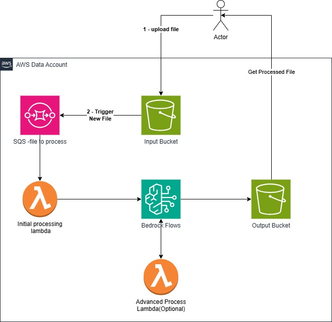

# AWS Bedrock Flows GenAI Demo

<!-- Insert your image here -->

## Overview

This repository contains a demonstration project showcasing generative AI capabilities using AWS Bedrock Flows. The solution provides a scalable, serverless architecture for implementing AI-powered features in your applications. The system processes files uploaded to an S3 bucket, triggering Lambda functions via SQS to interact with AWS Bedrock Flows for AI processing, with results stored in an output bucket.

## Features

- Serverless architecture using AWS Lambda
- Generative AI capabilities powered by AWS Bedrock
- Customizable workflows using AWS Bedrock Flows
- Easy deployment through CloudFormation

## Prerequisites

- AWS Account with appropriate permissions
- Access to AWS Bedrock service
- Basic understanding of AWS services (Lambda, CloudFormation)

## Quick Start Guide

### 1. Deploy the CloudFormation Stack

1. Navigate to the AWS CloudFormation console in your AWS account
2. Click "Create stack" and select "With new resources (standard)"
3. Select "Upload a template file" and upload the `CloudFormation.yaml` file from this repository
4. Follow the prompts to specify stack details and complete the deployment

### 2. Create Bedrock Flows

1. Navigate to the AWS Bedrock console
2. Select "Flows" from the navigation panel
3. Click "Create flow"
4. Design your AI workflow according to your application requirements
5. Test and publish your flow
6. Create an alias for your flow for stable references

### 3. Connect Lambda to Bedrock Flows

1. Navigate to the AWS Lambda console
2. Find and select the Lambda function created by the CloudFormation stack
3. Go to the "Configuration" tab and select "Environment variables"
4. Add/update the following environment variables:
   - `BEDROCK_FLOW_ID`: Your Bedrock Flow ID
   - `BEDROCK_FLOW_ALIAS_ID`: Your Bedrock Flow Alias ID
5. Save the changes

The Lambda function is already configured to:
- Listen for events from the SQS queue
- Process files uploaded to the input S3 bucket
- Send data to Bedrock Flows for AI processing
- Access the output S3 bucket for results storage

## Architecture

The solution uses a serverless architecture with the following components:

- **S3 Input Bucket**: Destination for file uploads that need AI processing
- **Amazon SQS**: Queues events when new files are uploaded to the input bucket
- **AWS Lambda**: Triggered by SQS events, processes the uploaded files and communicates with Bedrock Flows
- **AWS Bedrock**: Provides generative AI capabilities
- **AWS Bedrock Flows**: Orchestrates AI workflows based on the uploaded content
- **S3 Output Bucket**: Stores the results generated by Bedrock Flows
- **AWS CloudFormation**: Enables infrastructure as code deployment

The workflow is as follows:
1. User uploads a file to the input S3 bucket
2. The upload event triggers an SQS message
3. Lambda function is invoked by the SQS event
4. Lambda retrieves the file and sends relevant data to Bedrock Flows
5. Bedrock Flows processes the data using generative AI models
6. Results are stored in the output S3 bucket
